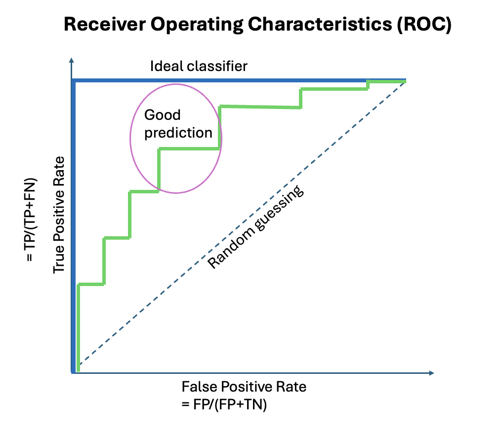
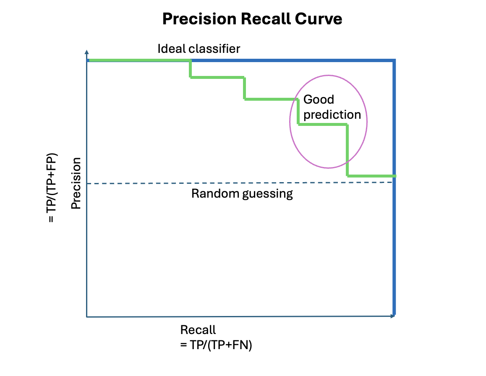

Here's a **clear, structured, and interview-ready** explanation of **AUC-ROC vs Precision-Recall Curve**, including when to use which.

### 1. What is ROC Curve and AUC-ROC?
The ROC curve is produced by calculating and plotting the true positive rate against the false positive rate for a single classifier at a variety of **thresholds**.

- **ROC Curve** (Receiver Operating Characteristic Curve) plots:
  - **True Positive Rate (Recall)** on the Y-axis
  - **False Positive Rate (1 - Specificity)** on the X-axis

**Key Formulas:**

$$\text{True Positive Rate (TPR)} = \frac{TP}{TP + FN} = \text{Recall} = \text{Sensitivity}$$

$$\text{False Positive Rate (FPR)} = \frac{FP}{FP + TN} = 1 - \text{Specificity}$$

Where:
- TP = True Positives
- FN = False Negatives
- FP = False Positives
- TN = True Negatives

- **AUC-ROC** (Area Under the ROC Curve) is a single number that summarizes the entire ROC curve.
  - AUC = **1.0** → Perfect classifier
  - AUC = **0.5** → Random guessing (no skill)
  - AUC < 0.5 → Worse than random

**Strengths of ROC Curve:**
- Easy to understand
- Works well when classes are **balanced**
- Shows trade-off between sensitivity (recall) and specificity

**Weakness:**
- Can be **misleading** when the dataset is **highly imbalanced**.

### 2. What is Precision-Recall Curve?

- **Precision-Recall Curve** plots:
  - **Precision** on the Y-axis
  - **Recall** on the X-axis

- **Average Precision (AP)** or **Area Under PR Curve** is the summary metric.

**Strengths of PR Curve:**
- Much more **informative** when there is **class imbalance** (positive class is rare).
- Focuses only on the **positive class** performance.

**Weakness:**
- Harder to interpret compared to ROC curve.

### 3. Side-by-Side Comparison

| Aspect                        | **ROC Curve (AUC-ROC)**                          | **Precision-Recall Curve**                          |
|-------------------------------|--------------------------------------------------|-----------------------------------------------------|
| Y-axis                        | True Positive Rate (Recall)                      | Precision                                           |
| X-axis                        | False Positive Rate                              | Recall                                              |
| Best for                      | Balanced datasets                                | Imbalanced datasets                                 |
| Focus                         | Both positive and negative classes               | Only positive class                                 |
| When positive class is rare   | Overly optimistic                                | More realistic and informative                      |
| Summary Metric                | AUC (0.5 to 1.0)                                 | Average Precision (AP)                              |
| Interpretation                | Easier                                           | Slightly harder                                     |

### 4. When to Use Which? (Most Important for Interview)

Here’s the **rule of thumb** interviewers expect you to know:

| Situation                                      | Use Which Curve?       | Reason |
|-----------------------------------------------|------------------------|--------|
| Classes are **roughly balanced** (~50:50)     | **ROC-AUC**            | Reliable and easy to interpret |
| Classes are **highly imbalanced** (e.g., 1% positive) | **Precision-Recall**   | ROC can be misleadingly high |
| You care more about **positive class performance** | **Precision-Recall**   | Focuses only on positives |
| You need a general overview                   | Start with ROC, then check PR if imbalanced | Safe approach |
| Business cares about **minimizing false positives** | **Precision-Recall**   | Directly shows precision |

**Real-world examples:**

- **Fraud Detection** → Use **Precision-Recall** (fraud is very rare ~0.1%)
- **Spam Detection** → Use **Precision-Recall** (spam is minority class)
- **Disease Screening** (e.g., cancer) → Often **Precision-Recall** because false negatives are costly
- **Customer Churn Prediction** (if churn rate is 5–10%) → Usually **Precision-Recall**
- **Image classification** with balanced classes → **ROC-AUC** is fine

### Best Practice

> “I generally start with **AUC-ROC** because it’s easy to interpret. However, when the dataset is **imbalanced** (which is very common in real-world problems like fraud, churn, or rare disease detection), I prefer the **Precision-Recall curve**. This is because ROC curve can give an overly optimistic view by considering the majority negative class, whereas PR curve focuses only on the positive class performance, which is usually what the business cares about.”

### Typical Question

> “If your model has AUC-ROC = 0.95 but PR-AUC = 0.45, what does this tell you?”

**Answer:**
> “It tells me the dataset is highly imbalanced. The model is good at ranking, but because positives are rare, precision drops quickly as we increase recall. In this case, I would optimize using the Precision-Recall curve and consider techniques like class weighting, oversampling, or adjusting the decision threshold.”
---
